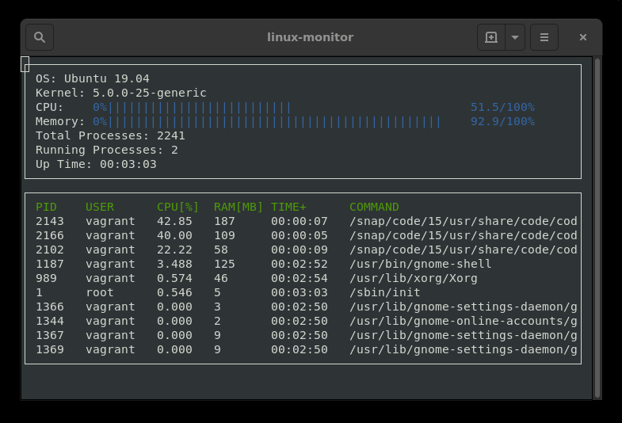

# Linux Monitor
Abstract: This is a completion of the [System Monitor Project](https://github.com/udacity/CppND-System-Monitor).

## Description
This project is a Linux system monitor. Data that it reports includes memory and CPU utilization of the system and of the system's most intense software processes. The top ten processes are listed in order of descending CPU usage. This project is written in C++, compliant with the 2020 standard. It employs the [ncurses](https://www.gnu.org/software/ncurses/) C/C++ user interface library.

<br>
*Sample Execution Screenshot*

## Initial Environment
The project development was completed on Bento/Ubuntu 19.04 with the following packages `libncurses5-dev`, `build-essential` and `cmake`. The build-essential package included the GCC 8 compiler. This compiler was employed to compile C++ code according to the 2017 standard.

## Latest Environment
The project was migrated to a virtual machine having the Bento/Ubuntu 20.04 Linux distribution with the following packages installed via the APT package manager:
```
  gcc-10
  g++-10
  clang
  libncurses-dev
```
The NCURSES C++ library header is <curses.h>. The project can be compiled according to the C++ 2020 standard, with either GCC 10 or LLVM 10 Clang.


## Execution
This project runs on a Linux command line interface. It uses [Make](https://www.gnu.org/software/make/) and [CMake](https://cmake.org/). The following commands are executed in the top project directory, where `Makefile` and `CMakeLists.txt` reside.

1. To build the project executable, enter one of the following:
   1. `make bldg` to build with GCC 10
   1. `make bldc` to build with LLVM 10
1. To run the project executable, enter: `build/monitor`
